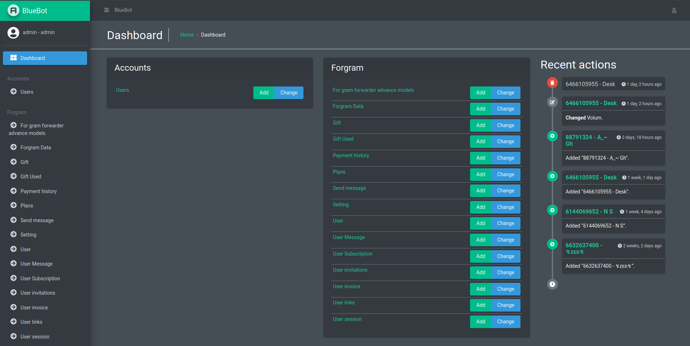
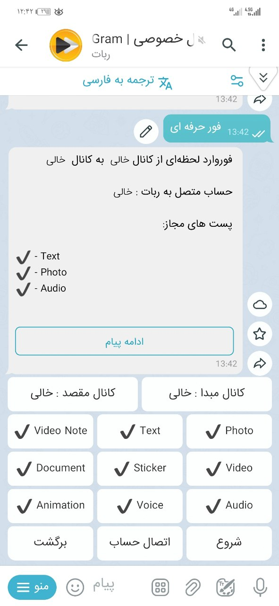
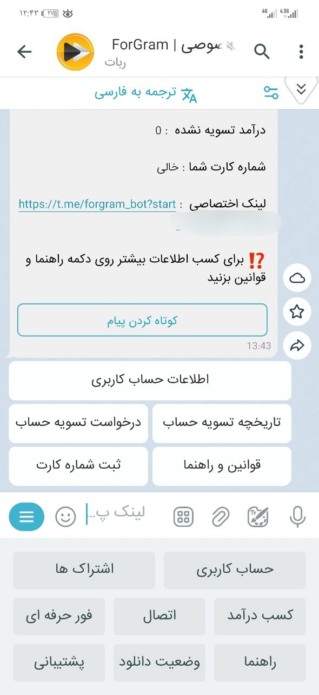

# ادمین پنل

- مدیریت کامل یوزر ها و کاربران
- ارسال پیام تکی و همگانی به کابران
- ایجاد کد تخفیف زمان دار  و حجمی 
- مدیریت زیرمجموعه ها پرداختی هایه کاربران
- ایجاد پلن های متنوع حجمی و زمان دار
- تنظیم متن همه بخش های ربات 
- مدیریت تسک ها
- اضافه کردن ربات های دلخواه

    

 

## قابلیت‌های ربات

- دانلود از کانال/گروه/ربات‌های خصوصی
- دانلود لحظه‌ای به محض انتشار پست
- دانلود همه پست به صورت یکجا 
- زیرمجموعه‌گیری دو لایه برای کسب درآمد
- تعریف پلن‌ها و حجم‌های متنوع برای استفاده کاربران
- ادمین پنل حرفه‌ای توسعه یافته با جنگو
 

    <table>
        <tr>
            <td>
                
            </td>
            <td style="width: 25px;"></td> <!-- فاصله بین دو عکس -->
            <td>
                
            </td>
        </tr>
    </table>

 
 
 

